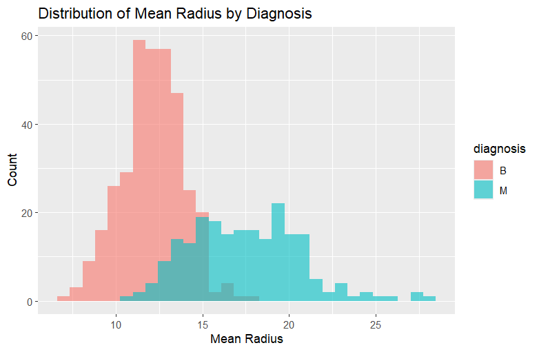
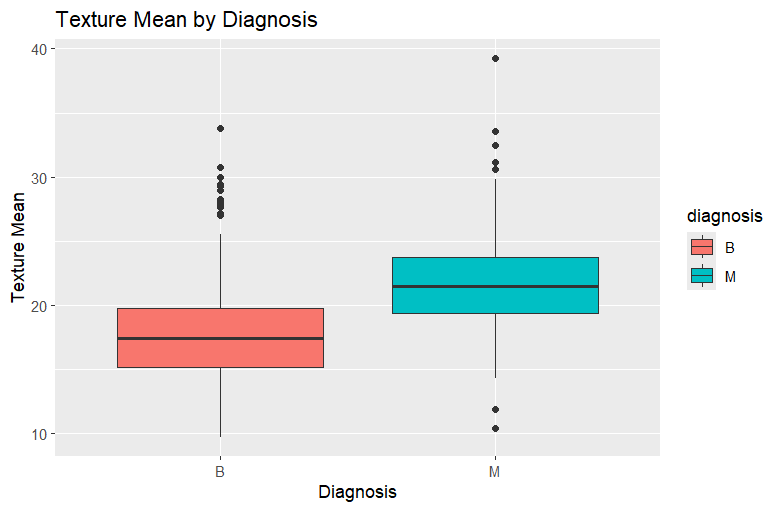
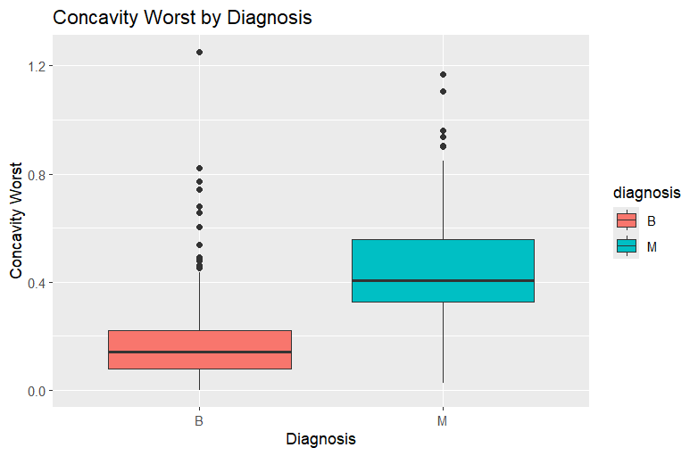
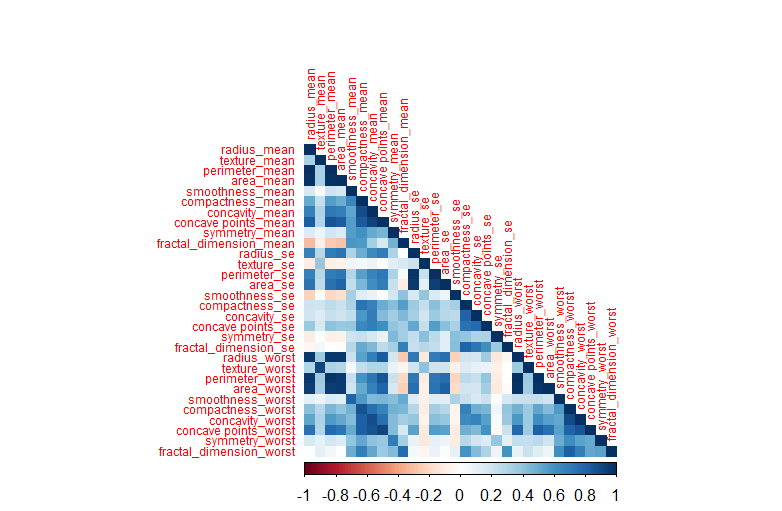

# BreastCancer-R-Analysis
Analysis of benign vs malignant breast tumors using R.
  
  
  

---

##  Table of Contents
- [Overview](#overview)
- [Dataset](#dataset)
- [Tools & Packages](#tools--packages)
- [Analysis Steps](#analysis-steps)
- [Results](#results)
- [How to Run](#how-to-run)
## Overview
This project analyzes a breast cancer dataset to distinguish between **Benign (B)** and **Malignant (M)** tumors.  
The dataset contains measurements of cell nuclei from breast cancer biopsies, with features such as radius, texture, perimeter, area, smoothness, concavity, and more.  

The goal of this project is to perform **exploratory data analysis (EDA)** and visualize key differences between benign and malignant tumors.

##  Dataset
- **Source:** Breast Cancer Wisconsin Diagnostic Dataset  
- **File:** `data.xlsx`  
- **Rows:** 569 samples  
- **Columns:** 32 (ID, Diagnosis, and 30 numeric features)  
- **Class Distribution:** 357 Benign, 212 Malignant  

## Tools & Packages
- R & RStudio  
- `readxl` – to load Excel data  
- `tidyverse` – for data cleaning & wrangling  
- `ggplot2` – for plotting histograms and boxplots  
- `corrplot` – for correlation heatmap 

## Analysis Steps
1. Load and clean dataset (remove ID, convert diagnosis to factor).  
2. Generate summary statistics.  
3. Visualize distributions:  
   - Histogram of `radius_mean` by diagnosis  
   - Boxplots of `texture_mean` and `concavity_worst`  
4. Compute correlation matrix and plot heatmap.  

## Results
- Malignant tumors show **higher radius, area, concavity, and concave points** compared to benign tumors.  
- Histograms and boxplots clearly separate benign vs malignant cases.  
- Strong correlations observed among `radius_mean`, `perimeter_mean`, and `area_mean`.  






## How to Run
1. Clone this repository  
2. Open `breast_cancer_analysis script.R` in RStudio  
3. Make sure `data.xlsx` is in the same folder  
4. Install required packages:  

```r
install.packages(c("readxl", "tidyverse", "ggplot2", "corrplot"))
